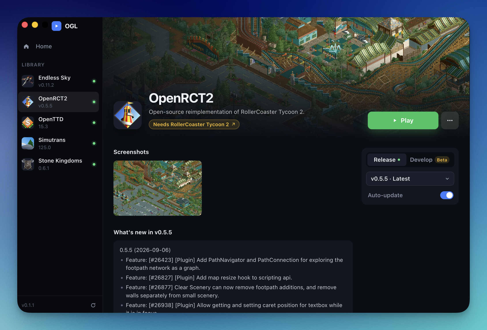

# OGL

Open Game Launcher. A desktop app for macOS, Windows, and Linux that installs, updates, and launches open-source games such as OpenRCT2, OpenTTD, and OpenLoco.



> [!WARNING]
> OGL has only been tested on macOS so far, and only the Mac version is signed and checked by Apple. The Windows and Linux versions are built automatically but have not been tried on a real machine yet. If something does not work there, please [open an issue](https://github.com/fabianfreund/OpenGameLuncher/issues).

## Install

Download the file for your system from the [latest release](https://github.com/fabianfreund/OpenGameLuncher/releases/latest). The files are listed under **Assets** at the bottom of the release. `x.y.z` below stands for the version number.

### macOS

Which file you need depends on your Mac. Open the Apple menu → **About This Mac**:

| About This Mac shows | Download |
| --- | --- |
| Chip: Apple M1, M2, M3, … | `OGL-x.y.z-arm64.dmg` |
| Processor: Intel | `OGL-x.y.z.dmg` |

1. Open the downloaded `.dmg` and drag **OGL** into **Applications**.
2. Open OGL from Applications. macOS asks once whether you want to open an app downloaded from the internet. Click **Open**.

The Mac version is signed and checked by Apple, so there is no further warning.

### Windows

Download `OGL-Setup-x.y.z.exe`.

1. Run the downloaded file.
2. Windows shows "Windows protected your PC", because the Windows version is not signed yet. Click **More info**, then **Run anyway**.
3. Follow the installer. OGL appears in the Start menu.

### Linux

Download `OGL-x.y.z.AppImage`.

1. Make the file executable: right-click → **Properties** → **Permissions** → allow running as a program, or in a terminal:

   ```bash
   chmod +x OGL-*.AppImage
   ```

2. Double-click the file, or run `./OGL-*.AppImage`.

You can ignore the other files in the release (`.zip`, `.blockmap`, `.yml`). OGL uses them to update itself.

### Updates

OGL checks for a new version when it starts, and when you press the refresh button at the bottom left. A new version shows up in the sidebar with an **Update** button; OGL downloads it and restarts.

Mac versions before 0.1.5 cannot update themselves. If you have one, download the new `.dmg` once and replace the app in Applications.

## Why this exists

OGL is a hobby project. I love open-source games, but I got tired of the hassle: every game has its own website, its own download page, its own way of updating. I wanted one place that installs them, keeps them up to date, and starts them. So I built it.

It is made in my spare time, so expect rough edges, and do not expect fast answers.

## How it works

The games are a list of JSON files in [`catalog/games`](catalog/games). OGL reads that folder from this repository on launch, so a new game shows up without a new version of the launcher. Each game's versions come from that game's own GitHub releases.

OGL updates itself from the releases of this repository.

Some games have a mod browser on their page: NewGRFs for OpenTTD, plugins for OpenRCT2 and Endless Sky.

## Develop

```bash
npm install
npm run dev
```

`npm test` and `npm run typecheck` run the checks.

```
catalog/games        the games
src/shared           catalog rules and asset matching
src/main             window, downloads, launching, self-update
src/preload          the bridge into the window
src/renderer         the interface
```

## More

- [Adding games](docs/catalog.md)
- [Releasing OGL](docs/releasing.md)
- [AI usage policy](AI-POLICY.md): OGL is built with AI tools, and this is what that means for contributions

## Contact

Questions, ideas, or a game that should be in the catalog? Reach me here:

[](https://www.reddit.com/user/Big_Whale_95/)
[](https://x.com/FabianXR_Builds)

## License

[MIT](LICENSE)
